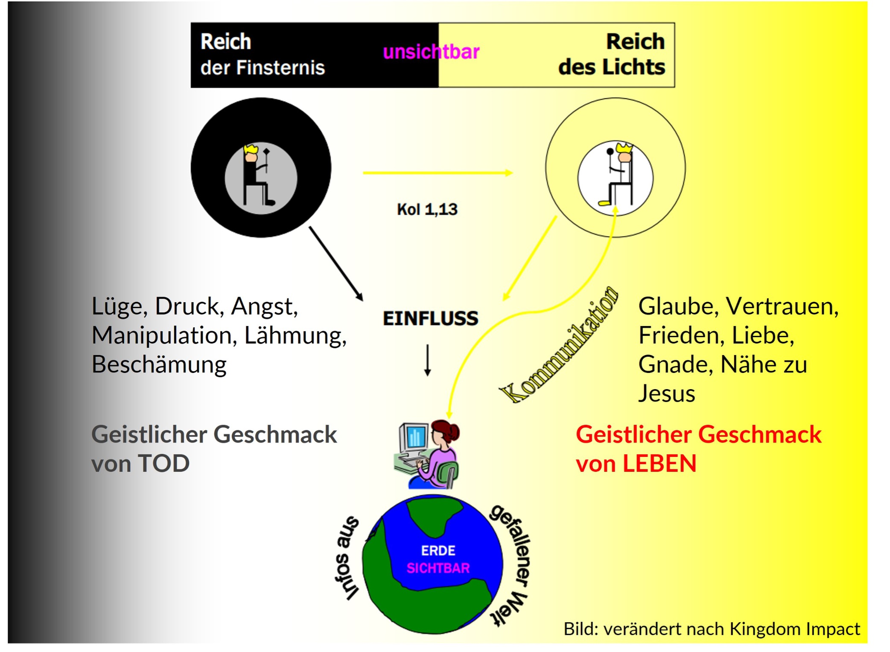
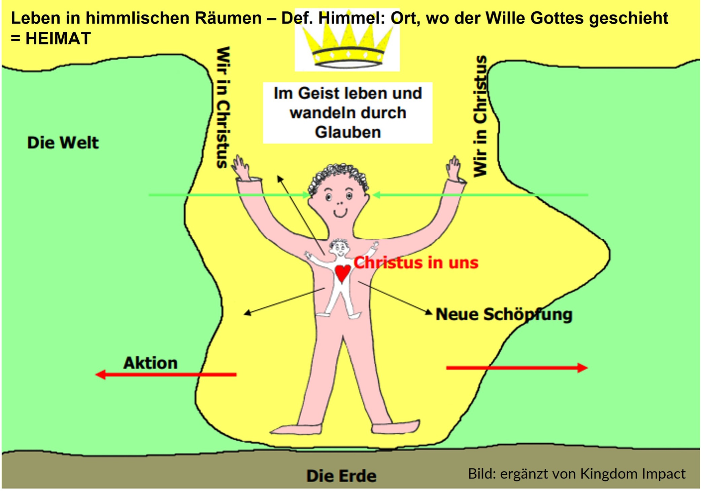

---
tags:
  - themen
---

# Göttliche Identität - Leben als Gesandte des Himmels 

???+ Übersicht

    #### Worum geht es in diesem Kapitel? 

    Als wiedergeborene Christen leben wir jederzeit in zwei Welten: In der sichtbaren Welt und im unsichtbaren Königreich Gottes, in das wir im Geist hineinversetzt wurden. Wir sind Gesandte des Himmels, um diesen auf Erden zu bringen. In dieser Identität und mit einer festen Verankerung unserer Heimat im Königreich Gottes machen wir einen gewaltigen Unterschied in unserem Umfeld. 

    #### Weshalb ist uns dieses Thema wichtig?  

    Unsere Identität ist eine Weltanschauungsfrage. Wer sind wir und wer ist unser Gott? Die Antworten auf diese Fragen beeinflussen uns maßgeblich in unserem Denken, Fühlen, Reden und Handeln. Wir möchten die grundlegende DNA vom Königreich Gottes Verständnis transportieren und tief in die Herzen gepflanzt sehen. Dies soll den Mentees zur Freisetzung ihres von Gott bestimmten Lebens dienen. 

    #### Wie unterstützt mich das Thema im Mentoring?

    Eine tief ins Reich Gottes gegründete Identität des Mentees wird diesen freisetzen und befähigen, den Willen Gottes für Entscheidungen und Wege zu erkennen und mutig zu gehen. Es wird beschrieben, wie das Wort Gottes als Versorgungs- und Kraftquelle erlebt werden kann. Wir sind immer wieder herausgefordert, uns im Geist richtig zu positionieren und die Wahrheit Gottes auf unsere Situationen anzuwenden. "Heimatnehmen" im Reich Gottes ist ein geistliches Training, das im Mentoring gefördert werden kann.

## Was hat unser Weltbild mit unserer Identität zu tun?

Als Christen verdanken wir Gott eine neue, geistliche Identität. Wer wir in IHM sind und wer Gott ist, sind die maßgebenden Größen für unser Weltbild. Eine Definition von „Weltbild“ könnte sein: eine Grundkonstruktion einer Realität, die uns vorgibt, was wir fühlen, denken und wie wir bewerten. Daraus ergibt sich unser Reden und Handeln. Es geht mir im Folgenden um einen Check, inwieweit wir in der biblischen Realität leben.

## Realität der unsichtbaren Einflüsse in unserem Leben

Was wir in unserer vernunftsgeprägten Kultur in der westlichen Welt leicht vergessen, ist die Dimension der unsichtbaren Welt. Die Bibel spricht klar von zwei unsichtbaren Reichen, die sich im Widerstreit zueinander befinden. Sie funktionieren mit völlig unterschiedlichen Herrschaftsprinzipien und beeinflussen uns beide. Dazu kommen Informationen aus dem Sichtbaren, der materiellen Welt, die Herrschaftsgebiet des Widersachers Gottes ist. Durch unsere Zugehörigkeit zum Reich des Lichts und dessen Herrscher, Jesus Christus, haben wir das Privileg, die Einflüsse geistlich zu unterscheiden. Je besser wir das Reich des Lichts kennen, desto sicherer können wir Einflüsse, die aus dem Reich der Finsternis kommen, entlarven und ihnen wehren. 

## Entlarve Dualismus in deinem Leben!

Ich möchte an dieser Stelle eine in Europa sehr verbreitete Gedankenfestung konfrontieren:

Das dualistische Weltbild, das durch Platon bereits 427 v.Chr. geprägt wurde und unser christliches Weltbild stark beeinflusst, trennt in zwei Welten: die materielle Welt und die Ideenwelt als Ort der Sehnsucht, der nur punktuell erreichbar ist. So teilen wir unser Leben oft in zwei Kategorien auf: weltliches und geistliches Leben. Damit klammern wir Gott oft automatisch und unbewusst aus. Aber die herrliche Wahrheit des Evangeliums ist: Gott ist uns nahegekommen! Er ist kein ferner Gott! Der Vorhang ist zerrissen und wir haben jederzeit Zugang zu Gott. Durch Jesus ist die Trennung zwischen Himmel und Erde aufgehoben. (Kol. 1,20) 

## Du bist beheimatet im Königreich Gottes

Wir sind aus dem Machtbereich der Finsternis herausgerettet und hinein versetzt in das Reich seines geliebten Sohnes. (Kol. 1,13)
So leben wir jederzeit gleichzeitig in zwei Welten: Wir sind wie Jesus in diese sichtbare Welt gesandt, um diese Welt mit dem Himmelreich - dem Königreich Gottes - in Kontakt zu bringen. Zwar sind wir IN der Welt, aber nicht mehr VON der Welt.  (Joh. 17,18)
Wir sind in Christus eine neue Kreatur. (2. Kor.5,17)
Als solche sind wir Mitbürger im Himmelreich und Gottes Hausgenossen! (Eph. 2,19) 
Hier sind wir auch nicht alleine. Hier gibt es eine geistliche Familie, Gefährten.
Unsere neue Heimat ist das Königreich Gottes, wo sein Wille geschieht, sein Wort regiert und wir im Glauben an und im Vertrauen in IHN leben. Unsere Versorgung erhalten wir von IHM. Was sein Wort sagt, steht über dem, was wir an Informationen aus der gefallenen Welt bekommen. Wir leben in Loyalität zu unserem König.
Das Wort Gottes eröffnet uns reale, himmlische Räume, die wir im Geist betreten können. 
Wir sind seine Botschafter, eine Armee Gottes und Mitarbeiter auf der Erde und beeinflussen somit unsere Umwelt in Seinem Sinne. Wir bringen ein Stück weit den Himmel auf Erden.
Wohin wir gehen, bringen wir die gesamte Realität des Königreiches Gottes mit uns mit. Wir sind Träger Seines Reiches.

## Wie geht's praktisch? 

Bei Weltbildfragen geht es letztlich immer um, was glaube ich? Was möchte ich an altem Denken ablegen und wo neue Wahrheit ergreifen? Möchtest du dieses Leben im Königreich Gottes und als Gesandter in diese Welt zunehmend zu Deinem machen? Es ist ein Trainingsprozess! Dafür brauchst du ein paar Schlüssel, die dir auf dem Weg helfen werden. Die meines Erachtens wichtigsten Schlüssel möchte ich hier kurz thematisieren:

-  Positioniere dich im Geist in das Königreich Gottes. Schenke dem Wort Gottes Glauben, entscheide dich dafür, auch wenn deine sichtbare Realität (noch) anders aussieht. Das Wort Gottes ist die Tür zur himmlischen Realität = Versorgungs- und Kraftquelle. 
- Spreche im Glauben, säe Wahrheit, predige dir selbst Gottes Wort – dadurch wird dein Glaube genährt und gestärkt. 
- Lerne die Einflüsse des Feindes zu entlarven und widerstehe ihnen entschlossen! (Jak.4,7+8). Mache den geistlichen Geschmackstest: Schmeckt etwas nach Leben oder nach Tod? Vgl. Abbildung "Leben in zwei Welten". Tipp: Je besser du deinen König kennst, desto leichter wirst du den Kontrast merken! 
- Überwinde Dualismus: Wo denkst du in den beiden Schubladen "weltlich" und "geistlich" und klammerst Gott damit aus? Lass dir von Gott eine konkrete Situation zeigen, die Er in Zukunft mit Seiner Gegenwart und Perspektive erfüllen möchte. 
- Strecke dich bewusst nach Erfüllung und Leitung durch den Heiligen Geist aus. Er möchte dir Offenbarung über das Reich Gottes schenken. Bete mit Eph.1,17ff.
-  Mache dich eins mit Gottes Absichten / Ordnungen / Willen. Stichwort "Alignment" = Übereinstimmung, Ausrichtung und Erneuerung deines Sinnes (Röm.12,2). Das Thema [Glaubenssätze](./glaubenssaetze.md) knüpft hier an.
-  Fülle dich mehr mit Gottes Wort als mit Nachrichten/Infos aus der gefallenen Welt.
- Suche dir Support durch ["Waffengeschwister"](./gefaehrtenschaft.md) – Gemeinsames Stehen und Ringen um das Leben im Reich Gottes ist sehr erfolgsversprechend und macht echt Freude! 

## Welche Konsequenz ist zu erwarten?

Das Leben in deiner himmlischen Heimat, dem Königreich Gottes, die gelebte Wahrheit über deiner Identität in Christus, dein Sendebewusstsein in die Welt und die enge Verbundenheit mit JESUS und Seinem Wort gibt dir geistliches Gewicht und Schlagkraft. Diese musst du nicht aus dir selbst hervorbringen, sondern es passiert ganz automatisch, wenn du im Königreich Heimat nimmst: Dein Denken, Fühlen, Reden und Handeln werden sich immer mehr verändern!

Damit bringst du großes Veränderungspotenzial in deinen Einflussbereich und wirst einen gewaltigen Unterschied machen, wohin dich Gott sendet. Denn du bist Gesandter aus einem anderen Reich. Gesandt von dem, der die Welt überwunden hat!

## Literatur/Quellen

- Die Bibel (insbesondere Kolosserbrief und Epheserbrief)
- [Das Wort ist die Tür zum Himmel](https://kingdom-campus.org/product/das-wort-ist-die-tuer-zum-himmel/)
- [Erneuere Dein Weltbild](https://kingdomimpact.de/shop/product_info.php?products_id=281) von [www.kingdomimpact.de](https://www.kingdomimpact.de)

??? info "Über den Autor/die Autorin"
    --8<-- "_autoren/thorwart-kirsten.md"
