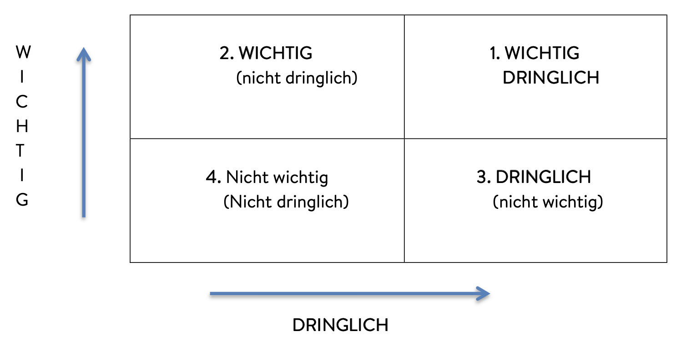

---
tags:
  - tools
---

# Eisenhower-Diagramm

- [ ] Quelle

!!! Anleitung

    ### Erklärung

    Das DISG-Persönlichkeitsprofil hilft. 

    ### Vorgehensweise

    Reflektiere über Erfahrungen, die du bisher in deinem Leben mit dem Thema "Leiterschaft" gemacht hast.

    ### Erwartungsbild

    Der Mentee kennt sich besser.

