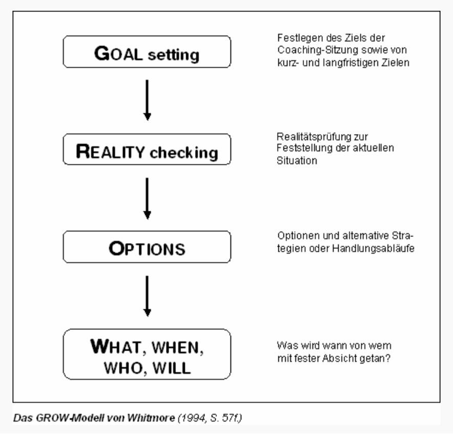

---
tags:
  - tools
---

# GROW

??? Anleitung

    #### Erklärung

    Ein Modell ist effektiv in der Anwendung, wenn der Mentor die Struktur gedanklich parat hat und das Gespräch entsprechend lenkt. 
    Es geht nicht darum, alle aufgeführten Fragen der Reihe nach zu stellen. 

    #### Vorgehensweise

    1. Der Mentee präsentiert ein konkretes Thema, in dem er weiterkommen will
    1. Anhand des Vierstufenmodells führt der Mentor durch das Gespräch, um das Thema vor allem auf potenzielle Hindernisse zu durchleuchten und konkrete Aufgaben zu erarbeiten.

    #### Ergebnis/Nutzen

    Der Mentee erfährt Wachstum.

John Whitmore stellt das GROW-Modell in einem seiner Bücher[^1] vor:

Im Kontext von Mentoring könnte das so ablaufen:

## <b>G</b>oal setting

Zu Beginn des Gesprächs wird das Ziel bzw. die Ziele des Treffens gemeinsam festgelegt. Dabei wird ein möglichst konkretes, überprüfbares Ziel angestrebt.

- Was ist Dein Ziel für dieses Mentoring-Gespräch? Formuliere sie mithilfe der SMART-Formel (spezifisch, messbar, akzeptiert, realistisch and terminiert). 
    - Text
    - Text
    - Text
    - Text

- Wobei wir Dich dieses Ziel unterstützen? 
    - Text
    - Text
    - Text
    - Text

- Passt Dein Ziel für das heutige Gespräch zu Deinen übergeordneten Zielen?
    - Text
    - Text
    - Text
    - Text

## <b>R</b>eality check

Als nächster Schritt wird die momentane Situation des Mentee analysiert. Stellt sich die Situation anders dar als zunächst im 1.Schritt angenommen, ist es ggf. möglich, dass das Ziel bzw. die Ziele erneut angepasst bzw. verändert werden müssen. Der Mentor sollte bei der Realitätsprüfung möglichst objektiv, unvoreingenommen und beschreibend statt beurteilend vorgehen. 

Als Hilfsmittel dienen ihm dazu verschiedene Formen von Fragen:

- Was wurde konkret unternommen?
- Welche Ergebnis hat dies erbracht?
- Was passiert bei Dir gerade? 
- Wie wichtig ist dies alles für Dich (Skala 1-10)? 
- Was für Auswirkungen hat das alles auf Dich? 
- Wie wirkt sich die Situation auf Deinen anderen Lebensbereiche aus? 
- Was tust Du bereits, um Deine übergeordneten Ziele zu erreichen? 
- Was tust Du derzeit, das Dich von Deinen Ziele entfernt? 
- Inwieweit stehen Deine übergeordneten Ziele mit anderen Zielen, die Du auch noch hast, im Konflikt?

 
 
 
 
 
 
 
 
 
 

## <b>O</b>ptions

Beim Herausarbeiten von möglichen Vorgehensweisen, Optionen und alternativen Strategien ist es für den Mentor besonders wichtig, keine eigenen Ideen für den Mentee zu entwickeln, sondern darauf zu achten, dass der Mentee mögliche Optionen selbst findet (Hilfe zur Selbsthilfe). 

Die primäre Aufgabe des Mentors besteht darin, eine Arbeitsatmosphäre zu schaffen, die dies ermöglicht. Inhaltlich geht es nicht darum, eine "richtige" Alternative zu entwickeln; stattdessen sollen zunächst möglichst viele Alternativen entwickelt werden, bei denen die Durchführbarkeit und Realitätsnähe (noch) nicht berücksichtigt werden muss. 

Negative und selbstbeschränkende Vorannahmen des Mentee ("Es geht nicht", "Zu teuer", "Keine Zeit", ...) kann der Mentor entschärfen, z.B. durch "Was wäre, wenn...?"-Fragen. Jede Idee – sei sie auch scheinbar noch so widersinnig – erst mal aufschreiben. 

Fragen:

- Was könntest Du tun (Ideen, Alternativen)? 
    - Text
    - Text
    - Text
    - Text

- Was hat in der Vergangenheit funktioniert? 
    - Text
    - Text
    - Text
    - Text

- Wer oder was könnte Dich jetzt unterstützen? 
    - Text
    - Text
    - Text
    - Text

- Wo könntest Du mehr herausfinden, um vorwärtszukommen? Wie könnte das gehen?
    - Text
    - Text
    - Text
    - Text

## <b>W</b>ill

In der abschließenden Phase wird vom Mentee, basierend auf den vorangegangenen drei Schritten, entschieden und aufgeschrieben, was er konkret unternehmen wird, Der Mentee behält dabei stets die Wahlfreiheit bezüglich der zu verwirklichenden Ziele. Für die konkrete Umsetzung empfiehlt sich, in Anlehnung an Whitmores Ausführungen, folgende Fragen:

- Was wirst Du tun?

    Diese Frage impliziert eine konkrete Anforderung an den Mentee. Auf der Basis des bisherigen Gespräches muss er nun Angaben zum weiteren Vorgehen machen.

    - Text
    - Text
    - Text
    - Text

- Wann wirst Du es tun?

    Hier achtet der Mentor darauf, dass konkrete Angaben gemacht werden. Ggf. fragt er wiederholt nach.

    - Text
    - Text
    - Text
    - Text

- Wird die Handlung zum gewünschten Ziel führen?

    Es wird geprüft, ob der festgelegte Handlungs- und der Zeitrahmen den Mentee auch zum Ziel führen. 
    Auf welche Hindernisse könntest Du stoßen?
    Der Mentee benennt mögliche Probleme, die zum Abbruch der Zielerreichung führen oder als Vorwand dazu dienen könnten. Die bietet ihm die Möglichkeit sich darauf vorbeugend einzustellen.

    - Text
    - Text
    - Text
    - Text

- Wer muss es wissen?

    Der Mentee legt eine Liste mit allen Leuten an, die über die Zielsetzung informiert werden müssen. Dies dient dazu, die Beziehungen zu den, an der Zielerreichung Beteiligten, zu pflegen. 

    - Text
    - Text
    - Text
    - Text

- Welche Unterstützung benötigst Du?

    Der/die Mentee erläutert, welche Personen, Sachmittel und sonstigen Ressourcen er heranzieht.

    - Text
    - Text
    - Text
    - Text

- Wie und wann wirst Du diese Unterstützung erhalten?

    Der Mentor fragt hier (auch wiederholt) nach, bis der Mentee konkrete Angaben gemacht hat.

    - Text
    - Text
    - Text
    - Text

- Welche anderen Überlegungen hast Du (noch)?

    Diese Frage überprüft, dass alle für den Mentee wesentlichen Punkte auch besprochen werden. Er ist somit selber dafür verantwortlich, dass kein wichtiges Thema unberücksichtigt bleibt. 

    - Text
    - Text
    - Text
    - Text

- Bewerte auf einer Skala von eins bis zehn, wie sicher Du bist, dass Du die vereinbarten Handlungen auch ausführen wirst.

    Hier soll der Mentee seinen persönlichen Willen, das Ziel zu erreichen, beurteilen. Eine Bewertungen unter acht macht (lt. Whitmore) eine Zielerreichung unwahrscheinlich. Am Ende sollte eine Liste mit Handlungen vorliegen, die der Mentee auch alle realisieren will.

    - Skala: 1&nbsp;&nbsp;&nbsp;2&nbsp;&nbsp;&nbsp;3&nbsp;&nbsp;&nbsp;4&nbsp;&nbsp;&nbsp;5&nbsp;&nbsp;&nbsp;6&nbsp;&nbsp;&nbsp;7&nbsp;&nbsp;&nbsp;8&nbsp;&nbsp;&nbsp;9&nbsp;&nbsp;&nbsp;10

## Abschluss

Zum Abschluss gehen Mentor und Mentee die Aufzeichnungen mit allen Handlungsschritten und Antworten noch einmal durch, damit für den Mentee höchste Klarheit über die Schritte besteht. 
Ziel all dieser Maßnahmen ist es, dem Mentee deutlich zu machen, dass er für die Realisierung seiner Ziele selbst verantwortlich ist und genug Selbstbewusstsein hat, um seine Ziele erreichen zu können.

[^1]: John Whitmore, Coaching für die Praxis