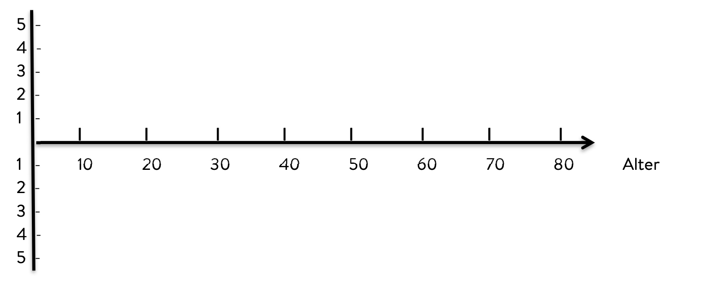

---
tags:
  - tools
---

# Lebenskurve

??? Anleitung

    #### Erklärung

    Bei der Lebenskurve geht es darum auf sein eigenes Leben zurückzublicken und jedes Jahr oder jeden Zeitabschnitt zu beurteilen, ob das Gefühl insgesamt positiv oder negativ war. 

    #### Vorgehensweise

    Markiere entlang der Zeitachse (Jahre), in welchem Maß du diesen Zeitpunkt bzw. Zeitraum als positiv (+) oder negativ (-) erlebt hast. Verbinde dann diese Markierungen miteinander, damit eine durchgehende Linie, die sogenannte Lebenskurve, entsteht.

    #### Ergebnis/Nutzen

    Als Mentee bekommst du ein Gefühl dafür, wie du welche Lebensabschnitte empfunden hat und zu welchen Zeiten es besonders bergauf, bergab oder seitwärts ging. Die Lebenskurve bietet somit eine Möglichkeit, die eigene Geschichte zu entdecken und zu verstehen. 

