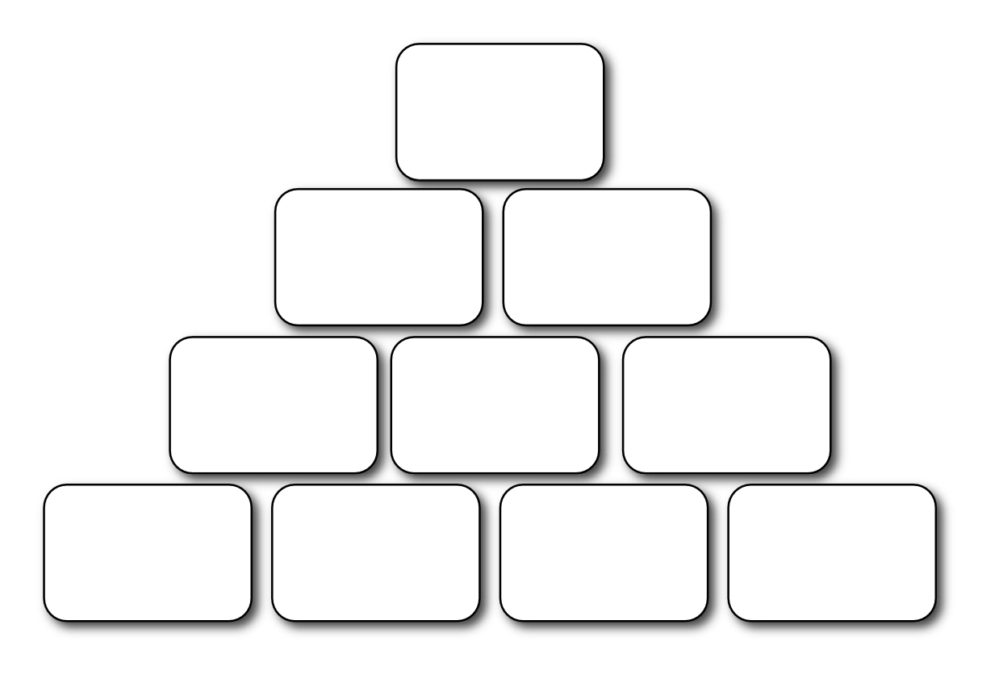

---
tags:
  - tools
---

# Natürliche Motivationsfähigkeiten

!!! Anleitung

    #### Erklärung

    Das DISG-Persönlichkeitsprofil hilft. 

    #### Vorgehensweise

    Lesen!!!

    #### Ergebnis/Nutzen

    Der Mentee kennt sich besser.

## Tätigkeiten mit Menschen [^1]

- Mit Einzelpersonen umgehen, mit Gruppen, Organisationen/großen Menschenmengen
- pflegen, betreuen
- beeinflussen
- befragen, interviewen
- beraten, diagnostizieren 
- dienen, helfen
- bedienen
- empfangen, verwöhnen 
- massieren, behandeln
- eine Dienstleistung erbringen
- therapieren, heilen
- kommunizieren
- sich gut ausdrücken
- unterrichten, lehren
- trainieren, unterstützen 
- stärken, ermutigen
- Menschen zusammenbringen
- Menschen einschätzen
- beurteilen, überprüfen
- auswählen
- überzeugen
- motivieren, werben
- verkaufen
- etw. repräsentieren
- eine Gruppe moderieren 
- leiten
- unterhalten
- amüsieren,
- inspirieren
- predigen
- spielen
- zur Entspannung + Bewegung anleiten
- Schulungen entwickeln
+ durchführen - überwachen
- die Führung übernehmen
- Vorbild sein
- gründen, aufbauen 
- vermitteln
- zw. versch. Parteien Konflikte lösen

## Umgang mit Informationen + Sprache

- begreifen
- Zusammenhänge verstehen
- berichten
- bewerten
- darstellen
- einschätzen
- entscheiden
- formulieren
- erzählen
- finanzieren
- rechnen
- kontrollieren
- vergleichen
- errechnen
- zusammenstellen
- analysieren
- koordinieren
- Neuerungen einführen 
- Verbindungen herstellen
- Infos sammeln
- recherchieren
- beobachten
- neue Ideen ausdenken 
- entwerfen
- Empfehlungen geben
- Buchführung
- mit Zahlen arbeiten
- organisieren
- systematisieren
- strukturieren
- Prioritäten setzen
- planen
- programmieren
- Software entwickeln
- visualisieren
- Medien entwerfen
- kombinieren
- beurteilen
- Infos speichern
- andere informieren
- Konzepte entwickeln
- sich Details gut merken

## Tätigkeiten mit Material, Technik, dem eig. Körper, Nahrung, Tieren, Natur

- bauen
- renovieren
- Maschinen bedienen
- konstruieren
- beliefern
- entwickeln
- erfinden
- entdecken
- etw. anpflanzen
- einen grünen Daumen haben
- Umgang mit Tieren 
- restaurieren
- Fahrzeuge steuern
- Fahrzeuge zerlegen
- zusammenbauen
- fingerfertig sein
- Nahrung zubereiten - backen, kochen
- die Qualität kontrollieren
- nach Verbesserungen suchen
- in der Natur sein 
- Sport machen

## Kreativ-künstlerische Tätigkeiten

- dekorieren
- fotografieren 
- etw. graphisch darstellen
- basteln
- nähen
- sich körperlich ausdrücken 
- tanzen
- formen
- bildhauern 
- verzieren
- verschönern 
- Pantomime
- schauspielern 
- singen
- ein Instrument spielen 
- komponieren
- Literatur lesen oder verfassen
- Aufführungen inszenieren 
- etw. schön + ansprechend machen
- Sinn für Ästhetik haben

<figure markdown>
  
  <figcaption>Pyramide der natürlichen Motivationsfähigkeiten</figcaption>
</figure>

[^1]: aus: Bolles, Richard (2002): Durchstarten zum Traumjob. Das Handbuch für Ein-, Um- und Aufsteiger